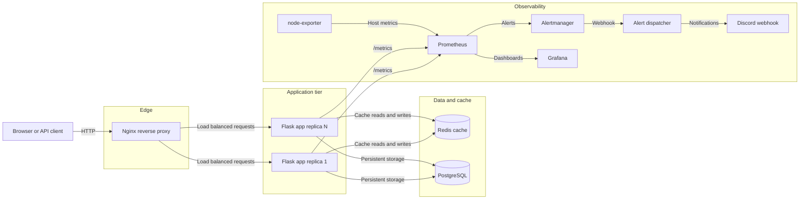

# UpShort

UpShort is a URL shortening service built with Flask, PostgreSQL, Redis, and a Docker Compose deployment that includes Nginx, Prometheus, Alertmanager, and Grafana.

## What It Does

- Registers and authenticates users with server-side sessions.
- Creates, edits, deletes, and lists user-owned short URLs.
- Resolves public short links through a cache-first lookup path.
- Tracks redirect analytics such as click count, unique visitors, device type, referrer, and last visitor metadata.
- Exposes health and Prometheus metrics endpoints.
- Ships with monitoring and alert forwarding to Discord.
- Seeds sample users, URLs, and events when the database starts empty and seed CSV files are present.

## Architecture



### Request Flow

1. Clients enter through Nginx on port `80` by default.
2. Flask handles authenticated CRUD routes and public redirect routes.
3. Redirect lookup checks in-memory cache first, then Redis, then PostgreSQL.
4. Cache misses are hydrated from PostgreSQL and written back to both cache tiers.
5. Metrics are scraped by Prometheus and alerts are routed through Alertmanager to the in-repo dispatcher.

## Repository Layout

```text
app/                         Flask app, models, routes, validation, metrics, logging
monitoring/prometheus/       Prometheus config and alert rules
monitoring/alertmanager/     Alertmanager routing config
nginx/                       Reverse proxy config
seed/                        Optional CSV seed data for empty databases
tests/                       Unit and route tests
docs/runbooks/               Operational runbooks
docs/decisions/              Technical decision records
```

## Local Setup

### Prerequisites

- Python `3.13`
- PostgreSQL `16+`
- Redis `7+`
- Docker and Docker Compose if you want the containerized stack

### Environment

Copy the example file and update secrets before first real deployment:

```bash
cp .env.example .env
```

Minimum values to review:

- `SECRET_KEY`
- `SEED_DEFAULT_PASSWORD`
- `DATABASE_*`
- `REDIS_*`
- `LOG_VIEWER_PASSWORD`
- `DISCORD_WEBHOOK_URL` if alert delivery to Discord is required

### Install Dependencies

```bash
python -m venv .venv
source .venv/bin/activate
pip install -e ".[dev]"
```

### Start Supporting Services

If PostgreSQL and Redis are not already running locally, the quickest path is Docker Compose:

```bash
docker compose up -d db redis
```

### Run the App

```bash
python run.py
```

The app listens on `http://localhost:5000` by default.

### Verify Startup

```bash
curl http://localhost:5000/health
curl http://localhost:5000/metrics
```

Expected health behavior:

- `200` when bootstrap and database checks pass
- `503` when database bootstrap is incomplete or PostgreSQL is unavailable
- `200` with `"state":"degraded"` when PostgreSQL is healthy but Redis is unavailable

## Docker Deployment

This repository’s primary deployment story is Docker Compose.

### Start the Full Stack

```bash
docker compose up --build -d
```

Default exposed ports:

- App entrypoint via Nginx: `80`
- Prometheus: `9090`
- Alertmanager: `9093`
- node-exporter: `9100`
- Grafana: `3000`

### Scale the App Tier

The Compose file defaults to `APP_REPLICAS=4`.

```bash
APP_REPLICAS=6 docker compose up --build -d
```

You can also inspect running replicas with:

```bash
docker compose ps app
```

### Deployment Checklist

1. Update `.env` with production values.
2. Confirm `SECRET_KEY` and `LOG_VIEWER_PASSWORD` are not defaults.
3. Start or refresh the stack with `docker compose up --build -d`.
4. Check `docker compose ps`.
5. Verify `GET /health`.
6. Verify the login screen loads through Nginx.
7. Confirm Prometheus targets are healthy at `http://localhost:9090/targets`.
8. If Discord alerting is enabled, send a test alert through Alertmanager or inspect dispatcher logs.

## Rollback

There is no dedicated release automation in the repo today, so rollback is an operator-driven redeploy.

### Roll Back to a Previous Commit

```bash
git checkout <known-good-commit>
docker compose up --build -d
```

### Roll Back to a Previous Image Tag

If your environment publishes versioned images outside this repo, redeploy the previously known-good image for the `app` service and keep the same database and Redis volumes.

### Post-Rollback Validation

```bash
curl -f http://localhost/health
docker compose ps
docker compose logs app --tail=100
```

Important notes:

- Rollback is safest when database schema changes remain backward-compatible.
- This app auto-creates tables and adds a small set of columns at startup. It does not include down-migrations.
- If a rollback depends on schema reversal, treat that as a manual recovery event and follow a database backup/restore procedure outside this repo.

## API Documentation

The app supports browser form posts and JSON APIs on the same routes. JSON behavior is used when the request body is JSON or the `Accept` header prefers `application/json`.

### Authentication

#### `POST /register`

Creates a user and starts a session.

JSON request:

```json
{
  "email": "user@example.com",
  "password": "strong-password",
  "confirm_password": "strong-password"
}
```

Success response: `201`

```json
{
  "id": 1,
  "email": "user@example.com"
}
```

Failure cases:

- `400` invalid email, missing fields, or password mismatch
- `409` duplicate email

#### `POST /login`

Authenticates a user and starts a session.

JSON request:

```json
{
  "email": "user@example.com",
  "password": "strong-password"
}
```

Success response: `200`

```json
{
  "id": 1,
  "email": "user@example.com"
}
```

Failure cases:

- `400` invalid request shape
- `401` invalid credentials

#### `POST /logout`

Clears the session and redirects browser users to the login page.

### URL Management

Authenticated routes require a valid session cookie.

#### `POST /urls/new`

Creates a short URL.

JSON request:

```json
{
  "target_url": "https://example.com/article",
  "slug": "launch-2026",
  "is_active": true,
  "expires_at": "2026-12-31T23:59",
  "metadata_title": "Launch Article",
  "metadata_description": "Campaign landing page",
  "metadata_tags": "launch,campaign"
}
```

Behavior:

- `slug` is optional for JSON requests; an 8-character slug is generated when omitted.
- Valid slugs are `3-64` characters using letters, numbers, `_`, or `-`.
- Reserved slugs include `api`, `dashboard`, `health`, `login`, `logout`, `metrics`, `register`, `urls`, and `static`.
- `expires_at` accepts `YYYY-MM-DDTHH:MM` or `YYYY-MM-DDTHH:MM:SS`.

Success response: `201`

Possible alternative success: `200` when the same create request is retried and the existing row is reused after a unique constraint conflict.

#### `POST /urls/<url_id>/edit`

Updates an existing URL owned by the logged-in user.

Notes:

- For JSON requests, omitted `slug` keeps the current slug.
- Returns `404` if the URL does not exist for that user.
- Returns `409` on slug conflict.

#### `POST /urls/<url_id>/delete`

Deletes an existing URL owned by the logged-in user.

JSON success response: `204`

### Redirects

#### `GET /<slug>`

Resolves a short URL and returns an HTTP `302` with a `Location` header.

Behavior:

- Checks in-memory cache, then Redis, then PostgreSQL.
- Adds `X-Cache-Tier` header with `local`, `shared`, or `fresh`.
- Increments redirect analytics.
- Returns `404` when the link is missing or inactive.
- Returns `410` when the link is expired.

### Operations Endpoints

#### `GET /health`

Returns a structured health payload with:

- top-level state
- bitmask status code
- bootstrap, database, and cache checks

#### `GET /metrics`

Exposes Prometheus metrics, including:

- `upshort_http_requests_total`
- `upshort_http_request_latency_seconds`
- `upshort_http_requests_in_progress`
- `upshort_cache_operations_total`
- `upshort_fallback_usage_total`
- `upshort_bootstrap_attempts_total`
- `upshort_bootstrap_retries_total`
- `upshort_process_cpu_usage_percent`
- `upshort_process_resident_memory_bytes`

#### `GET /dashboard`

Authenticated HTML dashboard listing the current user’s URLs.

#### `GET|POST /logs`

Authenticated HTML log viewer gated by `LOG_VIEWER_PASSWORD`.

## Environment Variables

| Variable | Required | Default | Purpose |
| --- | --- | --- | --- |
| `FLASK_DEBUG` | No | `false` | Enables Flask debug mode and reloader. |
| `SECRET_KEY` | Yes in non-dev | `dev-secret-change-me` at runtime fallback | Signs session cookies. |
| `SEED_DEFAULT_PASSWORD` | No | `seed-password` | Password assigned to seeded users from CSV. |
| `DATABASE_NAME` | No | `hackathon_db` | PostgreSQL database name. |
| `DATABASE_HOST` | No | `localhost` | PostgreSQL host. In Compose this is overridden to `db`. |
| `DATABASE_PORT` | No | `5432` | PostgreSQL port. |
| `DATABASE_USER` | No | `postgres` | PostgreSQL username. |
| `DATABASE_PASSWORD` | No | `postgres` | PostgreSQL password. |
| `DATABASE_POOL_MAX_CONNECTIONS` | No | `64` | Peewee pooled connection cap per app replica. |
| `DATABASE_POOL_STALE_TIMEOUT` | No | `300` | Seconds before stale pooled connections are recycled. |
| `DATABASE_POOL_TIMEOUT` | No | `30` | Seconds to wait for a pooled DB connection. |
| `REDIS_HOST` | No | `localhost` | Redis host. In Compose this is overridden to `redis`. |
| `REDIS_PORT` | No | `6379` | Redis port. |
| `NGINX_PORT` | No | `80` | Host port mapped to Nginx. |
| `PROMETHEUS_PORT` | No | `9090` | Host port mapped to Prometheus. |
| `ALERTMANAGER_PORT` | No | `9093` | Host port mapped to Alertmanager. |
| `NODE_EXPORTER_PORT` | No | `9100` | Host port mapped to node-exporter. |
| `GRAFANA_PORT` | No | `3000` | Host port mapped to Grafana. |
| `DISCORD_WEBHOOK_URL` | No | empty | Discord destination for Alertmanager notifications. |
| `CACHE_TTL_SECONDS` | No | `300` | TTL used for Redis cache entries. |
| `CACHE_MAX_ITEMS` | No | `5000` | Maximum entries in the per-process in-memory cache. |
| `LOG_LEVEL` | No | `INFO` | Root log level for structured JSON logs. |
| `LOG_FILE_PATH` | No | `logs/app.log` | Rotating log file path. |
| `LOG_FILE_MAX_BYTES` | No | `1048576` | Log rotation size threshold. |
| `LOG_FILE_BACKUP_COUNT` | No | `5` | Number of rotated log files retained. |
| `LOG_VIEWER_TAIL_LINES` | No | `200` | Default number of lines shown in the log viewer. |
| `LOG_VIEWER_PASSWORD` | Yes if `/logs` is used | empty runtime fallback | Additional password gate for in-app log viewing. |
| `PORT` | No | `5000` | Flask bind port. |
| `ALERT_DISPATCHER_PORT` | No | `9094` | Port used by the Discord bridge service. |
| `APP_REPLICAS` | No | `4` in Compose | Number of `app` service replicas for Compose deployment. |

## Observability and Alerting

Prometheus scrapes:

- the Flask app on `/metrics`
- Prometheus itself
- `node-exporter`

Alert rules cover:

- app target down
- bootstrap failures
- elevated 5xx rate
- slow request p95
- high host load
- host memory pressure
- host disk pressure

Alert flow:

1. Prometheus evaluates rules from [`monitoring/prometheus/alerts.yml`](monitoring/prometheus/alerts.yml)
2. Alertmanager routes grouped notifications using [`monitoring/alertmanager/alertmanager.yml`](monitoring/alertmanager/alertmanager.yml)
3. The `alert-dispatcher` service forwards them to Discord when `DISCORD_WEBHOOK_URL` is configured

## Troubleshooting

### `/health` returns `503`

- Check `docker compose logs app --tail=200`.
- Confirm PostgreSQL is reachable with `docker compose ps db`.
- Validate `DATABASE_*` values.
- If startup is racing the database, wait for the health check to recover after bootstrap retries.

### Redirects fail but the dashboard loads

- Confirm the slug exists and is active.
- Check whether the URL is expired; expired links return `410`.
- Inspect app logs for route-level exceptions.

### Dashboard works but redirect analytics stop updating

- PostgreSQL may be unavailable while cached redirects still resolve.
- Check for elevated `upshort_fallback_usage_total{operation="redirect_click_count_cache_only"}`.
- Inspect database connectivity and pool exhaustion.

### `/logs` is unavailable

- Verify `LOG_VIEWER_PASSWORD` is configured.
- Confirm the log file path is writable.
- Check whether the request hit a different replica with a different local log file.

### Prometheus has a down target

- Open `http://localhost:9090/targets`.
- Confirm the container is running and reachable on the expected internal port.
- For the app target, check `docker compose ps app` and `docker compose logs app`.

## Testing

Install dev dependencies and run:

```bash
pytest -q
```

CI also runs:

- `ruff check app run.py`
- `black --check app run.py`
- `python -m compileall app run.py`
- a smoke test for `create_app()`
- unit tests with coverage

## Documentation

- Runbooks: [`docs/runbooks/app-target-down.md`](docs/runbooks/app-target-down.md), [`docs/runbooks/database-unavailable.md`](docs/runbooks/database-unavailable.md), [`docs/runbooks/high-error-rate.md`](docs/runbooks/high-error-rate.md)
- Technical decisions: [`docs/decisions/0001-compose-first-deployment.md`](docs/decisions/0001-compose-first-deployment.md), [`docs/decisions/0002-cache-first-redirect-path.md`](docs/decisions/0002-cache-first-redirect-path.md), [`docs/decisions/0003-in-app-observability-and-alerting.md`](docs/decisions/0003-in-app-observability-and-alerting.md)
